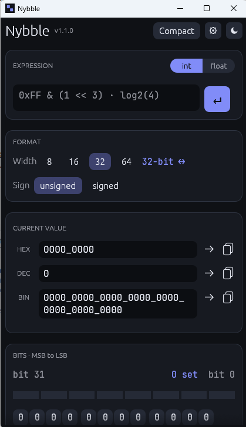

# Nybble

Tired of the Windows calculator ? Here is Nybble, a calculator targeted at people often needing to switch or mix bases (like FPGA engineers).

<p align="center">
  
</p>

## What it does

- **All bases at once.** Edit HEX, DEC, BIN, or OCT and the rest update as you type. No
  convert button, no mode switch.
- **Width and signedness.** 8/16/32/64-bit presets or any custom width (1–128), unsigned
  or two's-complement. Truncation and arithmetic vs. logical `>>` match what the hardware
  actually does, so the decimal you see is the decimal you'd get.
- **Clickable bits.** The grid runs MSB→LSB, grouped by nibble — click a bit and
  everything updates.
- **Real expressions.** Type `0xFF & (1 << 3)`, mix bases (`0x`, `0b`, `0o`, decimal) with
  `_` separators, and reuse the last result as `ans`. There's `**` for powers and the
  functions you'd reach for — `sqrt`, `log2`, `clog2`, `gcd`.
- **Float mode** when you've left the integers behind: the usual scientific set (`sin`,
  `cos`, `log`, …) plus `pi`, `e`, `tau`.
- **Fixed-point (Qm.n).** A view, not a math mode — read or enter the current value as a
  fixed-point real (the raw bits stay exact). Arithmetic happens on the integer bits or in
  float mode.

## Download & install

Grab the latest build from the [Releases page](https://github.com/fanaloka47/nybble/releases)
— it's a single self-contained binary, no installer required.

> On Windows the binary is unsigned, so the first launch shows a SmartScreen
> "unknown publisher" prompt — choose **More info → Run anyway**.

Once installed, the app checks GitHub for newer releases on launch and offers a one-click
**Update & restart**.

## Build from source

Requires a [Rust toolchain](https://rustup.rs):

```sh
cargo run -p nybble-gui      # launch the app
cargo build --release        # produce target/release/nybble
cargo test                   # run the core test suite
```

## Project layout

```
crates/
  core/   nybble-core — pure, UI-free numeric logic (fully unit-tested)
  gui/    nybble-gui  — eframe/egui desktop app (binary: `nybble`)
```

All number logic lives in `core` and is tested without the GUI; the GUI is a thin
presentation layer over it.

## Notes & limits

- Values are capped at **128 bits** for now. Wider buses (256/512-bit) would need an
  arbitrary-precision backend — a possible future extension.
- Fixed-point conversion goes through `f64`, so very wide values or many fractional bits
  can lose precision in the *displayed* real (the raw bits remain exact).
</content>
